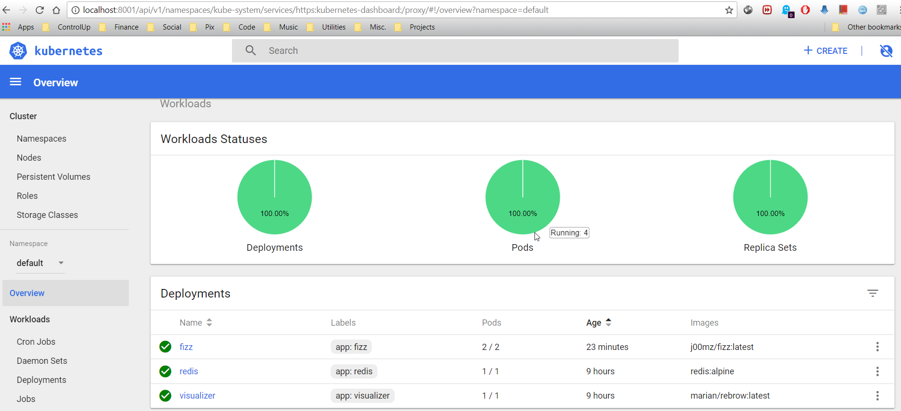
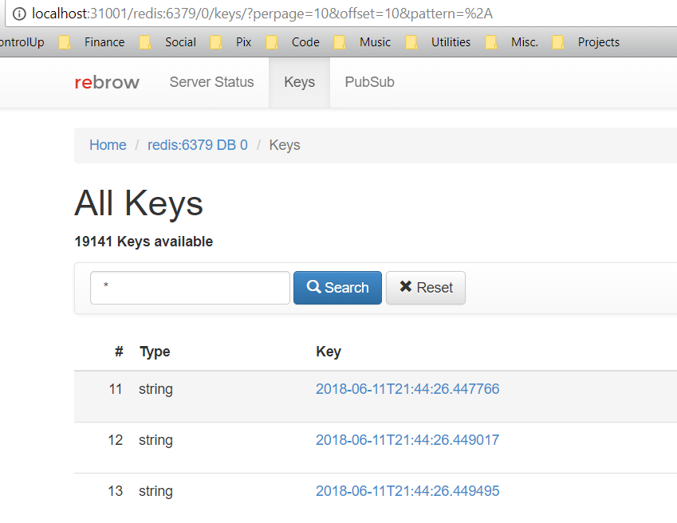

# K8s DevOps Challenges

## Install Prerequisites

Install all dependencies described [here](Prerequisites.md) 

You can use the following scripts:  
`./install_all.sh`  
And then start minikube  
`./run_minikube`  

## Running with docker-compose  

- clone repo:  
  `git clone git@github.com:J00MZ/k8s-devops-challenge.git`
- Ensure images built locally will be recognized by minikube  
  `eval $(minikube docker-env)`
- Build images  
  `cd k8s-devops-challenge`  
  `docker-compose build`
- Run app  
  `docker-compose up -d`
- View logs  
  `docker-compose logs`  

The above commands should have the app + db ([redis](https://redis.io/)) up and running.  
The fizz app generates logs to stdout and to a redis database.  
  


## Deploy to Kubernenetes

The kubernetes Services and Deployments are in the `k8s` folder  
To Deploy services to Kubernetes run:  
``` shell
cd k8s
kubectl create -f ./k8s  

```

Make sure the Kubernetes Dashboard is installed on the cluster 

``` shell
kubectl create -f https://raw.githubusercontent.com/kubernetes/dashboard/master/src/deploy/recommended/kubernetes-dashboard.yaml
```

With minikube the dashboard should come installed already.  
To enable run

``` shell
minikube dashboard
```

To access the Dashboard on `localhost:8001` run  

``` shell
kubectl proxy
```

The URL for the Default Namespace  
`http://localhost:8001/api/v1/namespaces/kube-system/services/https:kubernetes-dashboard:/proxy/#!/overview?namespace=default`

### The deployed app on Kubernetes


    
NOTE: the app itself is *not* designed to run forever.  
    however, the app runs fizzbuzz for 1000 times each time up to a random number in range of 1-1024 so it will generate quite an amount of logs doing so.  

## Visualize logs

Using Redis GUI client [rebrow](https://hub.docker.com/r/marian/rebrow/) Docker image as part of the deployment and the client to connect and see app logs in redis  

### Browsing the logs via Web UI  

Browse to `localhost:31001`  
insert hostname `redis` port `6379` database `0`  
Go to `keys` tab and see all recent log entries with log entry timestamp as keyname.  


